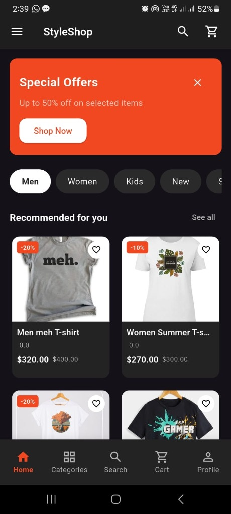
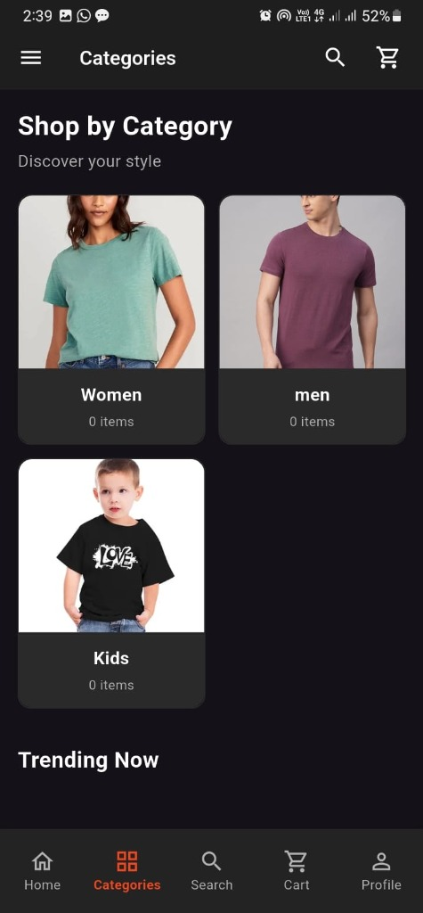
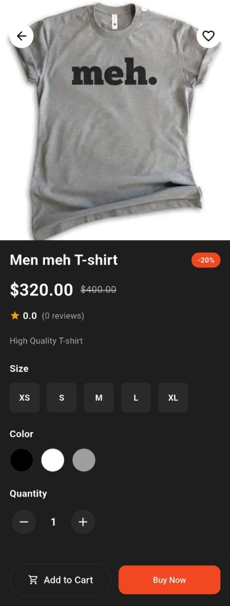
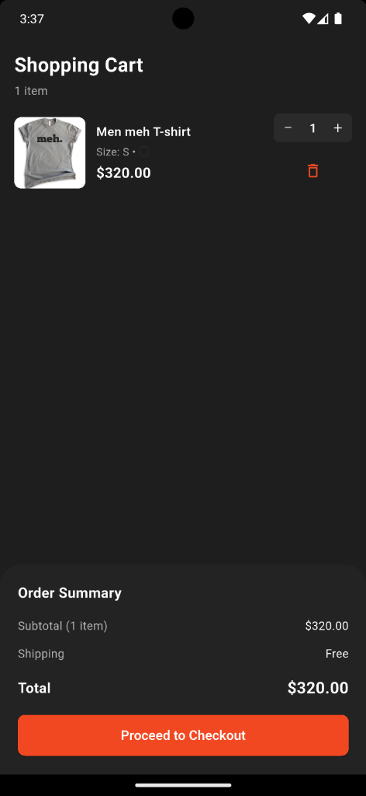
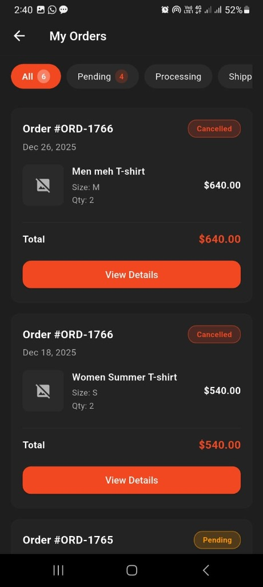
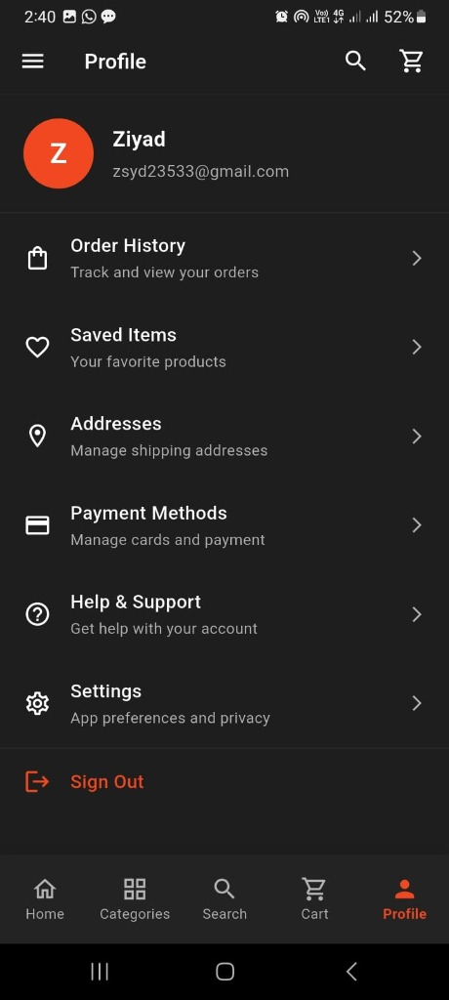

<div align="center">

  
  <h1>E-Commerce App</h1>
  
  <p>
    A premium, comprehensive E-Commerce solution built with Flutter.
  </p>
  
  
<!-- Badges -->
<p>
  <a href="https://flutter.dev">
    
  </a>
  <a href="https://dart.dev">
    
  </a>
  <a href="https://firebase.google.com">
    
  </a>
</p>
  
<h4>
    <a href="#features">Features</a>
  <span> · </span>
    <a href="#screenshots">Screenshots</a>
  <span> · </span>
    <a href="#tech-stack">Tech Stack</a>
  <span> · </span>
    <a href="#getting-started">Getting Started</a>
  <span> · </span>
    <a href="#project-structure">Structure</a>
</h4>
</div>

<br />

## 🚀 Features

Experience a seamless shopping journey with our robust feature set:

| Feature | Description |
| :--- | :--- |
| **🔐 Authentication** | Secure login & registration powered by Firebase Auth. |
| **🛍️ Product Browsing** | Advanced search, categories, and detailed product views. |
| **🛒 Shopping Cart** | Intuitive cart management with quantity adjustments. |
| **❤️ Favorites** | Save items to your wishlist for quick access later. |
| **📦 Order Management** | Track current orders and view order history. |
| **💳 Payments** | Secure payment integration for smooth checkout. |
| **📍 Address Book** | Manage multiple delivery addresses with ease. |
| **👤 User Profile** | Comprehensive profile management and settings. |

---

## 📸 Screenshots

| Home Screen | Categories | Product Details |
| :---: | :---: | :---: |
|  |  |  |

| Cart | Orders | Profile |
| :---: | :---: | :---: |
|  |  |  |


---

## 🛠️ Tech Stack

Built with a focus on performance and scalability:

- **Frontend:** [Flutter](https://flutter.dev/) (Dart)
- **Backend:** [Firebase](https://firebase.google.com/) (Auth, Firestore, Storage)
- **State Management:** [Provider](https://pub.dev/packages/provider)
- **Architecture:** Clean Architecture principles

---

## 🏁 Getting Started

Follow these steps to get the project up and running on your local machine.

### Prerequisites

- [Flutter SDK](https://docs.flutter.dev/get-started/install)
- [Git](https://git-scm.com/)

### Installation

1.  **Clone the repository**
    ```bash
    git clone <repository-url>
    cd e-commerce-app
    ```

2.  **Install dependencies**
    ```bash
    flutter pub get
    ```

3.  **Firebase Configuration**
    Make sure to configure your Firebase project and add the `firebase_options.dart` file.
    ```bash
    flutterfire configure
    ```

4.  **Run the application**
    ```bash
    flutter run
    ```

---

## 📂 Project Structure

A quick look at the top-level directory structure:

```
lib/
├── core/            # Shared utilities, constants, and widgets
├── features/        # Feature-based folder structure (Auth, Cart, etc.)
│   ├── auth/
│   ├── products/
│   └── ...
├── main.dart        # Application entry point
└── firebase_options.dart
```
